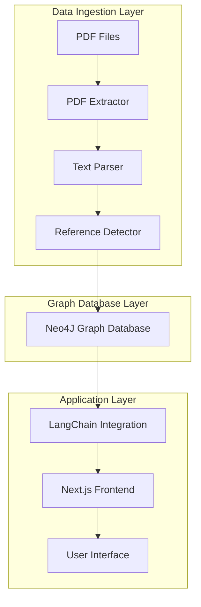
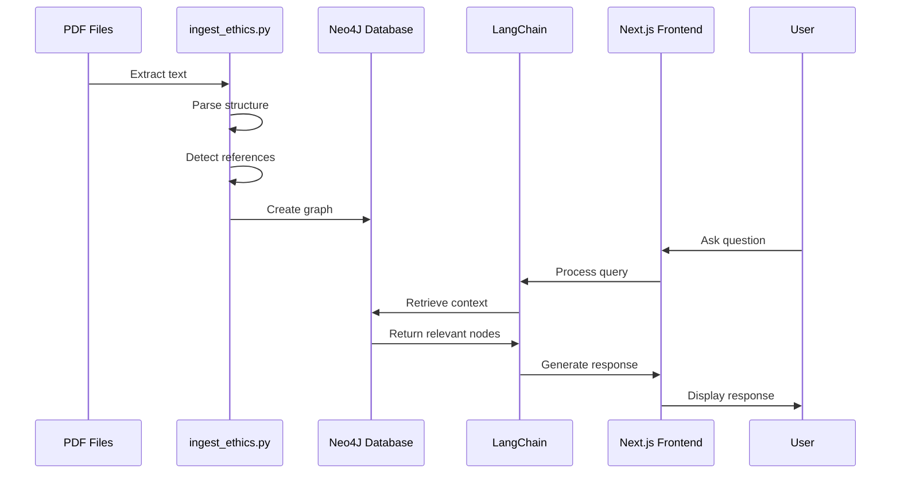

# System Patterns

## Architecture Overview

Spinoza-Me follows a three-tier architecture:

1. **Data Ingestion Layer**: Python scripts for processing PDF files and creating the Neo4J graph database
2. **Graph Database Layer**: Neo4J database storing the structured representation of Spinoza's Ethics
3. **Application Layer**: Next.js frontend with LangChain integration for the conversational interface

## Key Technical Decisions

### 1. Graph Database for Knowledge Representation

We chose Neo4J as our graph database because:

- **Natural Representation**: The structure of Spinoza's Ethics, with its parts, definitions, propositions, and references between them, naturally maps to a graph structure.
- **Relationship Queries**: Graph databases excel at queries that involve relationships and connections, which is essential for understanding the context of philosophical concepts.
- **LangChain Integration**: Neo4J has good integration with LangChain for RAG applications.

### 2. PDF Processing Approach

For extracting text from PDFs:

- **Text-Based Extraction**: Since we're working with text-based PDFs (not scanned images), we use pdfminer.six for direct text extraction rather than OCR.
- **Structured Parsing**: We parse the extracted text to identify structural elements (parts, definitions, propositions) based on patterns in the text.
- **Reference Detection**: We analyze the text to detect references between elements, which are crucial for understanding the relationships in Spinoza's work.

### 3. Graph RAG for Contextual Understanding

We use Graph RAG (Retrieval-Augmented Generation) to:

- **Maintain Context**: Preserve the relationships and connections between concepts in Spinoza's Ethics.
- **Provide Relevant Information**: Retrieve the most relevant parts of the Ethics based on user queries.
- **Generate Coherent Responses**: Use the retrieved information to generate responses that accurately represent Spinoza's ideas.

## Component Relationships

### Data Flow

### Component Dependencies

- **ingest_ethics.py** depends on:
  - pdfminer.six for PDF text extraction
  - neo4j for database connection
  - langchain for RAG integration

- **Neo4J Database** contains:
  - Nodes for parts, definitions, propositions, axioms, demonstrations, scholia, corollaries
  - Relationships for containment, ownership, and references

- **Next.js Frontend** (future development) will depend on:
  - Supabase for authentication and data storage
  - Tailwind CSS for styling
  - LangChain for connecting to the Neo4J database and generating responses

## Critical Implementation Paths

### 1. PDF Extraction and Parsing

The accuracy of the entire system depends on correctly extracting and parsing the text from the PDF files. This involves:

- Extracting text while preserving structure
- Identifying different elements (parts, definitions, propositions)
- Detecting references between elements

### 2. Graph Structure Design

The design of the graph structure is critical for effective retrieval and context understanding:

- Node types and properties
- Relationship types and directions
- Indexing for efficient queries

### 3. Query and Retrieval Mechanisms

The effectiveness of the conversational interface depends on:

- Translating user queries into effective graph queries
- Retrieving the most relevant context
- Maintaining conversation history for contextual understanding

## Design Patterns

### 1. Repository Pattern

The Neo4JDatabase class in ingest_ethics.py follows the Repository pattern, abstracting the database operations and providing a clean interface for creating and querying the graph.

### 2. Factory Pattern

The EthicsElement classes use a factory-like approach for creating different types of elements (Part, Definition, Proposition, etc.) with appropriate initialization.

### 3. Strategy Pattern

The text parsing and reference detection components are designed to allow for different strategies based on the language and format of the text.

### 4. Observer Pattern

The logging system acts as an observer, monitoring the progress of the ingestion process and reporting status updates.
